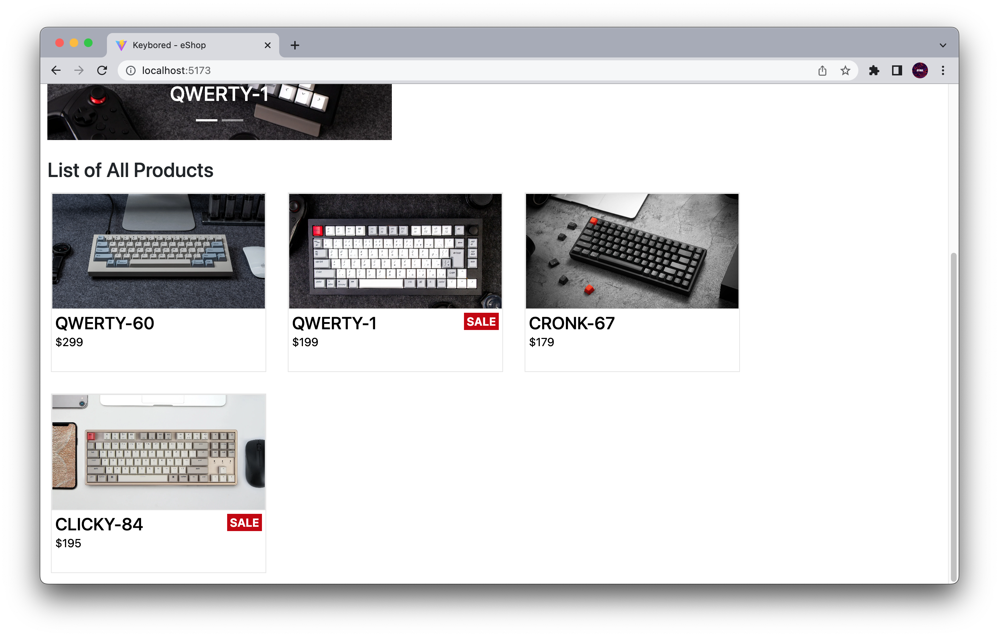
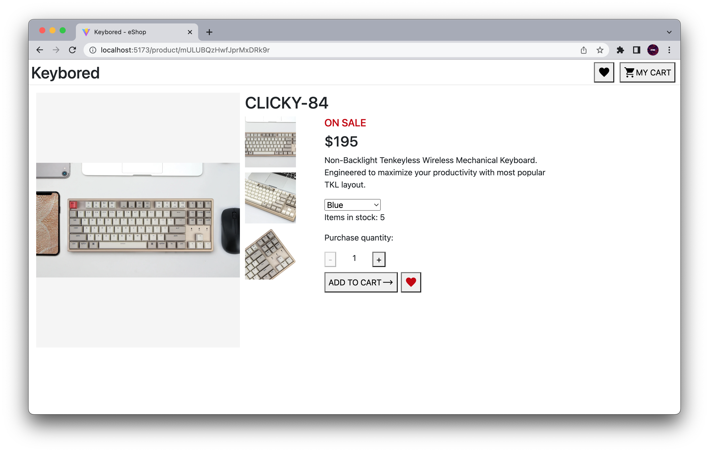

# Keybored - e-Store for Mechnical Keyboards

Online store for buying keyboards built using React and SCSS. The app uses Google Firebase - Firestore to
store and retrieve data.

## MVP

At a minimum the e-shop website should have two pages:

- [x] A Grid of products
- [x] Carousel of featured products
- [x] Product Page that allows you to add to cart and select product variants
- [x] All data should be stored in Firestore and fetched by the frontend, there should be NO static product data in the react application
- [x] You should store the following information: quantity, variants (could be colors, sizes, etc), price per unit, name, image url, favourited or not (boolean)

### BONUS

Create a cart system/page and add logic to prevent users from adding items to cart that are no longer in stock.
You will have to check the current cart and the product quantity Cart page should have the following:

- [x] List of products in cart
- [x] Ability to change quantity of products in cart
- [x] Ability to remove items from cart

## Features

- A favourites page to view all your favourited products
- A product page to view images and details about each product
- Cart System that does not allow to order more than stock availability

## Things to improve

- Potentially could create an array of promises and do Promise.all
- Manually create Carousal
- Add count of cart items to shopping cart item
- convert navigate to Links

## Useful Resources

- [Function Parameter as Object Key](https://stackoverflow.com/questions/11113008/in-javascript-how-can-i-use-a-function-parameter-as-the-key-to-an-object)
- [Updating arrays in State](https://beta.reactjs.org/learn/updating-arrays-in-state)
- [Popups in JS](https://www.w3schools.com/js/js_popup.asp)
- [searching through objects in arrays to find value](https://bobbyhadz.com/blog/javascript-check-if-array-contains-object)
- [React-router-dom](https://reactrouter.com/docs/en/v6/getting-started/overview)
- [Dummy JSON](https://dummyjson.com/)
- [Fake Store](https://fakestoreapi.com/)

---

### Reachout

- [LinkedIn](https://au.linkedin.com/in/ayushjames)
- [Email](mailto:ayushpjames@gmail.com)
